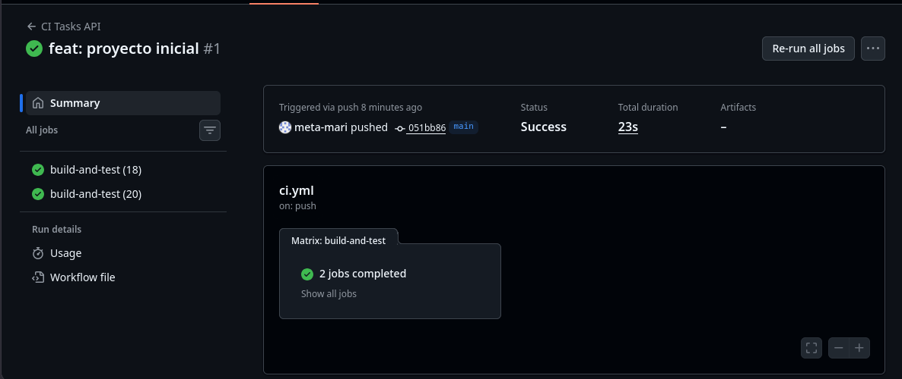
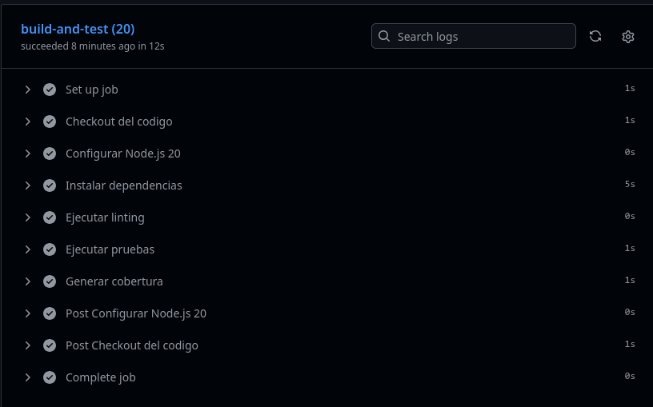
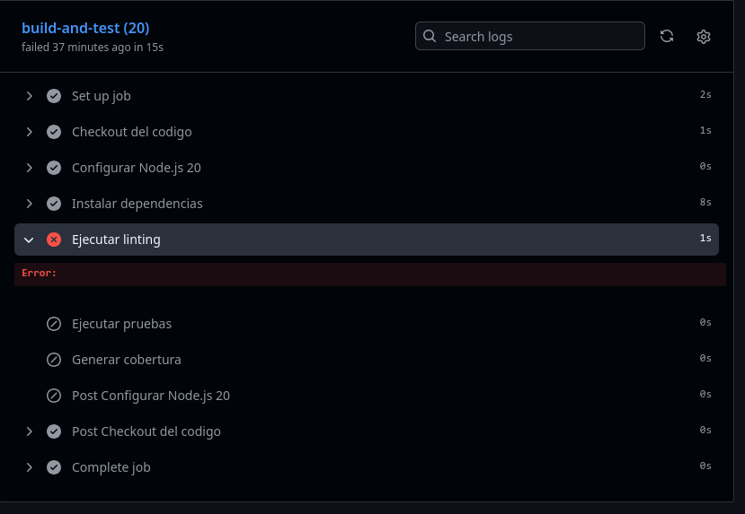
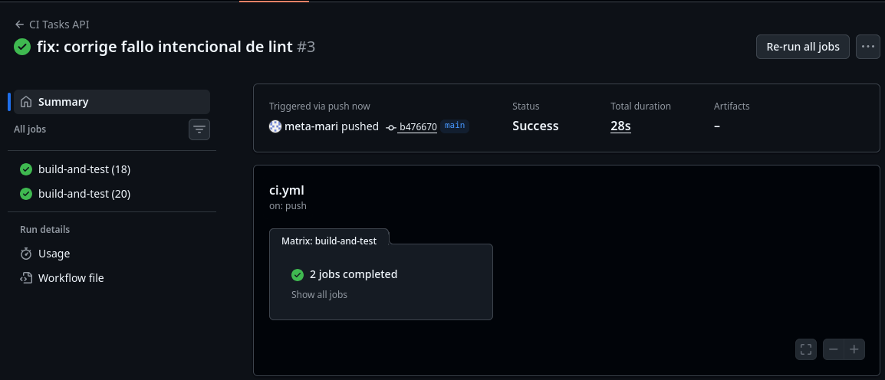
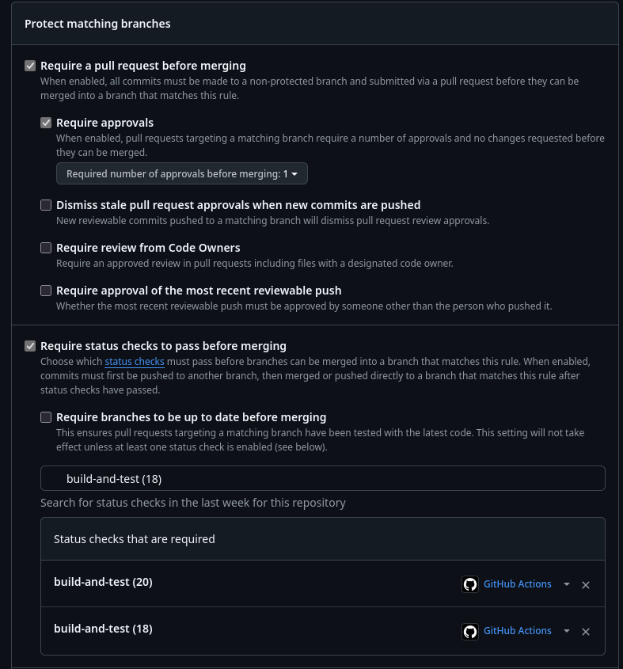
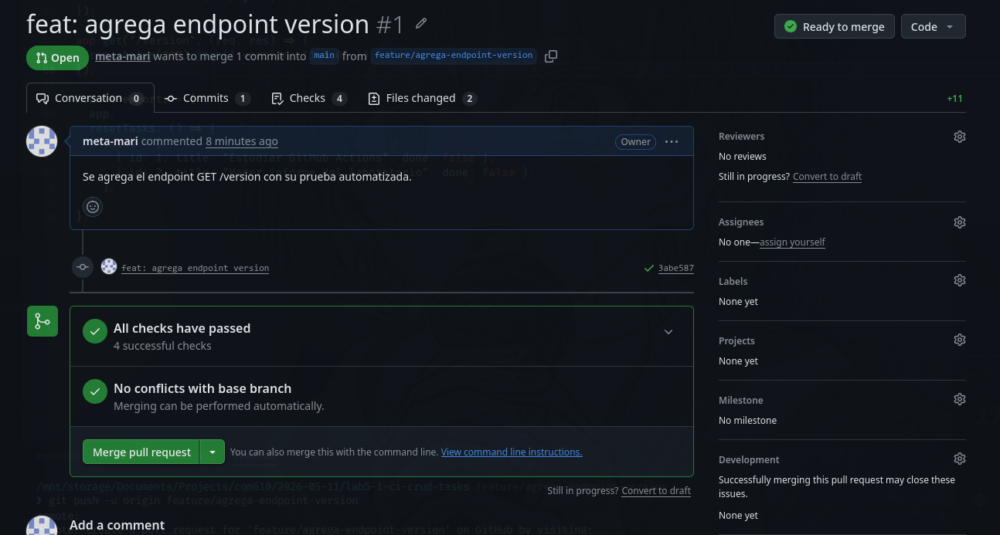
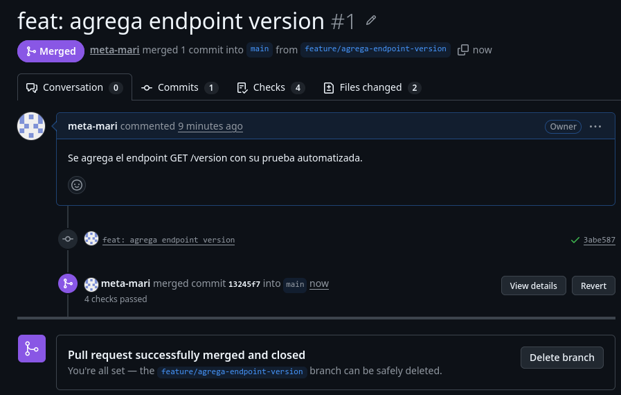

# INFORME - Laboratorio 5.1
## Creación de un workflow de GitHub Actions para CI

## 1. Datos generales

- **Estudiante:** [Tu nombre completo]
- **Materia:** [Nombre de la materia]
- **Carrera:** [Si corresponde]
- **Laboratorio:** 5.1
- **Tema:** Creación de un workflow de GitHub Actions para CI
- **Sistema utilizado:** Fedora KDE 44 Wayland x86-64
- **Repositorio GitHub:** [https://github.com/meta-mari/lab5-1-ci-crud-tasks

---

## 2. Descripción del proyecto

Se desarrolló una API CRUD sencilla con Node.js y Express para gestionar una entidad de dominio llamada `tasks`.  
El objetivo fue implementar un pipeline de Integración Continua (CI) usando GitHub Actions, de forma que cada cambio subido al repositorio sea validado automáticamente mediante linting, pruebas automatizadas y generación de cobertura.

La aplicación permite realizar operaciones CRUD sobre tareas, además de incluir un endpoint de verificación del estado del servicio.

### Endpoints implementados

- `GET /health`
- `GET /tasks`
- `GET /tasks/:id`
- `POST /tasks`
- `PUT /tasks/:id`
- `DELETE /tasks/:id`
- `GET /version`

---

## 3. Objetivo de la práctica

El objetivo de esta práctica fue configurar un workflow de GitHub Actions para ejecutar automáticamente validaciones de calidad sobre el proyecto cada vez que se realicen cambios en el repositorio o se abra una Pull Request.

De forma específica, se buscó:

- Automatizar la instalación de dependencias.
- Ejecutar análisis de estilo de código con ESLint.
- Ejecutar pruebas automatizadas con Jest y Supertest.
- Generar el reporte de cobertura.
- Verificar la ejecución del pipeline en múltiples versiones de Node.js.
- Configurar protección de la rama principal `main`.
- Validar el flujo de trabajo mediante una Pull Request.

---

## 4. Estructura del proyecto

La estructura principal del proyecto es la siguiente:

```text
lab5-1-ci-crud-tasks/
├── .github/
│   └── workflows/
│       └── ci.yml
├── app.js
├── server.js
├── app.test.js
├── package.json
├── package-lock.json
├── eslint.config.js
├── .gitignore
├── README.md
├── INFORME.md
└── capturas/
```

---

## 5. Tecnologías y herramientas utilizadas

* **Git**
* **GitHub**
* **Node.js**
* **npm**
* **Express**
* **Jest**
* **Supertest**
* **ESLint**
* **GitHub Actions**
* **Fedora KDE 44 Wayland x86-64**

---

## 6. Implementación del proyecto

Se creó una API básica en Express para administrar tareas almacenadas temporalmente en memoria.
Se implementaron rutas para crear, listar, obtener, actualizar y eliminar tareas.

Además, se agregó:

* un endpoint `/health` para comprobar que la aplicación está operativa
* un endpoint `/version` para usarlo como cambio funcional dentro de la Pull Request

También se desarrollaron pruebas automatizadas con Jest y Supertest para verificar el comportamiento esperado de los endpoints.

---

## 7. Configuración del pipeline de CI

Se configuró un workflow en el archivo:

```text
.github/workflows/ci.yml
```

Este workflow se ejecuta automáticamente en los siguientes eventos:

* `push` a la rama `main`
* `push` a ramas `feature/**`
* `pull_request` hacia la rama `main`

### Archivo del workflow

```yaml
name: CI Tasks API

on:
  push:
    branches: [main, "feature/**"]
  pull_request:
    branches: [main]

jobs:
  build-and-test:
    runs-on: ubuntu-latest

    strategy:
      matrix:
        node-version: [18, 20]

    steps:
      - name: Checkout del codigo
        uses: actions/checkout@v4

      - name: Configurar Node.js ${{ matrix.node-version }}
        uses: actions/setup-node@v4
        with:
          node-version: ${{ matrix.node-version }}

      - name: Instalar dependencias
        run: npm ci

      - name: Ejecutar linting
        run: npm run lint

      - name: Ejecutar pruebas
        run: npm test

      - name: Generar cobertura
        run: npm run test:coverage
```

---

## 8. Explicación del pipeline

El pipeline realiza las siguientes tareas:

1. **Checkout del código**
   Descarga el contenido del repositorio en el runner de GitHub Actions.

2. **Configuración del entorno Node.js**
   Se prepara el entorno de ejecución usando dos versiones distintas de Node.js: 18 y 20.

3. **Instalación de dependencias**
   Se ejecuta `npm ci` para instalar exactamente las dependencias registradas en `package-lock.json`.

4. **Linting**
   Se ejecuta ESLint para validar el estilo y detectar errores de calidad en el código.

5. **Pruebas automatizadas**
   Se ejecutan pruebas con Jest y Supertest para comprobar que la API funciona correctamente.

6. **Cobertura**
   Se genera un reporte de cobertura para comprobar qué parte del código fue ejecutada durante las pruebas.

---

## 9. Ejecución en múltiples versiones de Node.js

El workflow fue configurado con una estrategia de matriz para ejecutar el mismo job en dos versiones de Node.js:

* Node.js 18
* Node.js 20

Por esta razón, en GitHub Actions aparecen dos jobs con el mismo nombre base `build-and-test`, pero cada uno corresponde a una versión diferente del entorno. Esto permite verificar que la aplicación funciona correctamente en ambas versiones.

---

## 10. Comandos utilizados

A continuación se presentan los comandos más importantes utilizados durante el desarrollo de la práctica:

```bash
git init
npm init -y
npm install express
npm install --save-dev jest supertest eslint

npm run lint
npm test
npm run test:coverage
npm start

git add .
git commit -m "feat: sube proyecto completo con CI"
git push -u origin main

git checkout -b feature/agrega-endpoint-version
git add .
git commit -m "feat: agrega endpoint version"
git push -u origin feature/agrega-endpoint-version

git checkout main
git pull origin main
```

También se usó el siguiente comando para generar el archivo comprimido final:

```bash
cd ..
zip -r lab5-1_informe_apellidosnombres.zip lab5-1-ci-crud-tasks
```

---

## 11. Verificación local

Antes de subir cambios al repositorio, se realizaron verificaciones locales para asegurar que el proyecto funcionara correctamente.

### Linting

```bash
npm run lint
```

### Pruebas

```bash
npm test
```

### Cobertura

```bash
npm run test:coverage
```

Estas verificaciones permitieron detectar errores antes de ejecutar el pipeline remoto en GitHub Actions.

---

## 12. Evidencias del workflow en GitHub Actions

### 12.1 Historial de ejecuciones

En la pestaña **Actions** del repositorio se observó el historial de ejecuciones del workflow.
En la captura se muestra una ejecución exitosa correspondiente al commit inicial del proyecto.

.png)

### 12.2 Ejecución exitosa del workflow

La siguiente captura muestra el resumen de una ejecución exitosa del workflow.
Se puede observar que el pipeline finalizó correctamente y que la estrategia de matriz generó **dos jobs completados**.



### 12.3 Evidencia de la matriz de versiones

En esta ejecución se observa claramente que GitHub Actions creó dos jobs del mismo workflow:

* `build-and-test (18)`
* `build-and-test (20)`

Esto se debe a que el archivo `ci.yml` fue configurado con una matriz de versiones de Node.js para validar el proyecto tanto en Node 18 como en Node 20.


### 12.4 Detalle de un job exitoso

En la siguiente captura se muestra el detalle del job `build-and-test (20)`, donde se verifica que todas las etapas del pipeline se ejecutaron correctamente:

* checkout del código
* configuración de Node.js
* instalación de dependencias
* linting
* pruebas
* cobertura



### 12.5 Evidencia del paso de cobertura

Dentro del detalle del job exitoso puede verse que se ejecutó el paso **Generar cobertura**, lo que confirma que el workflow incluye el reporte de cobertura como parte del proceso de validación.


---

## 13. Simulación de fallo intencional

Para comprobar el comportamiento del pipeline ante errores, se introdujo intencionalmente una falla de linting en el archivo `app.js`.
Como resultado, el workflow falló en el paso **Ejecutar linting**, y las etapas posteriores no llegaron a ejecutarse.

### Evidencia del fallo por linting

En la siguiente captura se observa el job `build-and-test (20)` fallido exactamente en el paso de linting:



### Corrección del fallo y nueva ejecución exitosa

Después de eliminar el error introducido, se volvió a subir el cambio al repositorio y el workflow se ejecutó nuevamente con éxito en ambos jobs de la matriz.



---

## 14. Protección de la rama principal

Se configuró una regla de protección para la rama `main` desde la sección:

```text
Settings > Branches > Add rule
```

En la captura se observa que se activaron las opciones:

* **Require a pull request before merging**
* **Require status checks to pass before merging**

Además, se configuraron como obligatorios los checks:

* `build-and-test (18)`
* `build-and-test (20)`

### Evidencia de la protección de rama



---

## 15. Validación mediante Pull Request

Se creó la rama de trabajo:

```text
feature/agrega-endpoint-version
```

En esa rama se agregó el endpoint `GET /version` y su prueba automatizada, y posteriormente se abrió una Pull Request hacia `main`.

Durante este proceso se verificó que la Pull Request ejecuta automáticamente el workflow de CI y que, una vez aprobados los checks requeridos, quedó habilitada para realizar el merge.

### 15.1 Pull Request lista para merge

En la siguiente captura se observa la Pull Request ya validada, con todos los checks aprobados y sin conflictos con la rama base.
GitHub indica que la PR está **Ready to merge**.



### 15.2 Pull Request fusionada correctamente

Finalmente, la Pull Request fue fusionada exitosamente hacia la rama `main`.
La captura muestra el estado **Merged** y el mensaje de cierre correcto de la PR.



---

## 16. Observación sobre la revisión de la Pull Request

El trabajo fue realizado en un repositorio personal usando una sola cuenta.
Por ese motivo, la evidencia principal presentada en esta práctica corresponde al uso obligatorio de Pull Request y a la verificación automática de los checks del workflow antes del merge.

---

## 17. README del proyecto

Se actualizó el archivo `README.md` para incluir una descripción breve del proyecto y un enlace directo al presente informe `INFORME.md`, cumpliendo con lo solicitado en el enunciado.

---

## 18. URL del repositorio

**Repositorio GitHub:**

```text
https://github.com/meta-mari/lab5-1-ci-crud-tasks
```

---

## 19. Archivo ZIP entregable

Se generó el archivo comprimido final con toda la carpeta del proyecto:

```text
lab5-1_informe_apellidosnombres.zip
```

Este archivo contiene:

* código fuente
* workflow de GitHub Actions
* README
* INFORME
* capturas
* configuración del proyecto

---

## 20. Conclusiones

Mediante esta práctica se logró implementar un pipeline completo de Integración Continua para una aplicación CRUD sencilla desarrollada con Node.js y Express.

Se comprobó que GitHub Actions permite automatizar tareas clave del proceso de desarrollo, como la instalación de dependencias, la validación del código con linting, la ejecución de pruebas y la generación de cobertura.

También se demostró la utilidad de proteger la rama principal mediante reglas que exigen Pull Request y checks exitosos antes del merge, lo que ayuda a mantener la estabilidad del proyecto.

Finalmente, el uso de una estrategia de matriz permitió verificar el funcionamiento del proyecto en diferentes versiones de Node.js, aumentando la confiabilidad del proceso de validación.

---